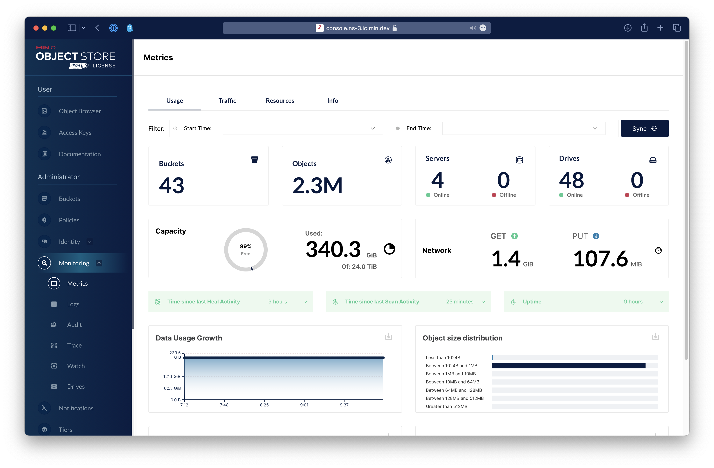
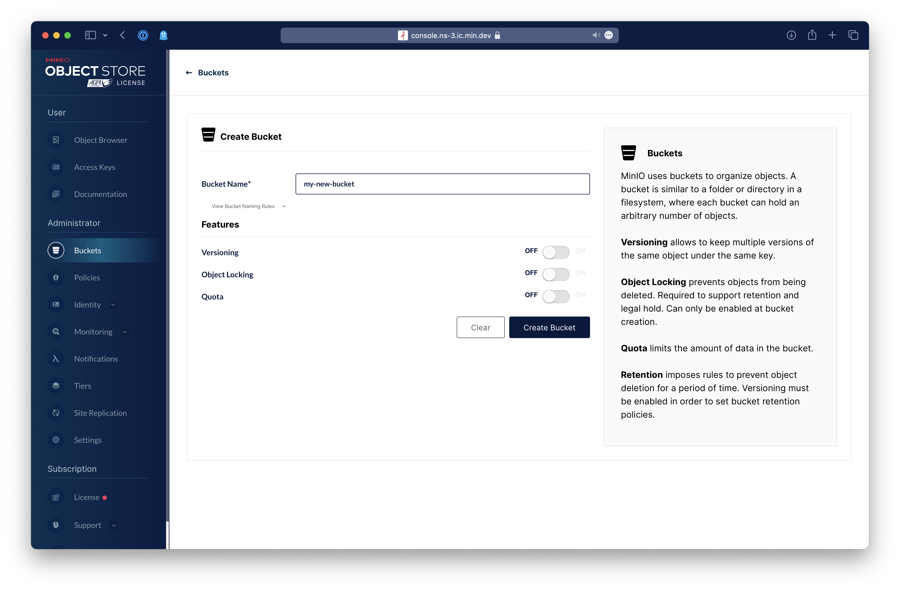

# Minio Console Server

A graphical user interface for [MinIO](https://github.com/minio/minio)


| Dashboard  | Adding A User |
| ------------- | ------------- |
|   |  |

## Setup

All `mcs` needs is a MinIO user with admin privileges and URL pointing to your MinIO deployment.
> Note: We don't recommend using MinIO's Operator Credentials

1. Create a user for `mcs` using `mc`. 
```
$ set +o history
$ mc admin user add myminio mcs YOURMCSSECRET
$ set -o history
```

2. Create a policy for `mcs` with access to everything (for testing and debugging)

```
$ cat > mcsAdmin.json << EOF
{
	"Version": "2012-10-17",
	"Statement": [{
			"Action": [
				"admin:*"
			],
			"Effect": "Allow",
			"Sid": ""
		},
		{
			"Action": [
                "s3:*"
			],
			"Effect": "Allow",
			"Resource": [
				"arn:aws:s3:::*"
			],
			"Sid": ""
		}
	]
}
EOF
$ mc admin policy add myminio mcsAdmin mcsAdmin.json
```

3. Set the policy for the new `mcs` user

```
$ mc admin policy set myminio mcsAdmin user=mcs
```


### Note
Additionally, you can create policies to limit the privileges for `mcs` users, for example, if you want the user to only have access to dashboard, buckets, notifications and watch page, the policy should look like this:
```
{
	"Version": "2012-10-17",
	"Statement": [{
			"Action": [
				"admin:ServerInfo"
			],
			"Effect": "Allow",
			"Sid": ""
		},
		{
			"Action": [
				"s3:ListenBucketNotification",
				"s3:PutBucketNotification",
				"s3:GetBucketNotification",
				"s3:ListMultipartUploadParts",
				"s3:ListBucketMultipartUploads",
				"s3:ListBucket",
				"s3:HeadBucket",
				"s3:GetObject",
				"s3:GetBucketLocation",
				"s3:AbortMultipartUpload",
				"s3:CreateBucket",
				"s3:PutObject",
				"s3:DeleteObject",
				"s3:DeleteBucket",
				"s3:PutBucketPolicy",
				"s3:DeleteBucketPolicy",
				"s3:GetBucketPolicy"
			],
			"Effect": "Allow",
			"Resource": [
				"arn:aws:s3:::*"
			],
			"Sid": ""
		}
	]
}
```

## Run MCS server
To run the server:

```
export MCS_HMAC_JWT_SECRET=YOURJWTSIGNINGSECRET

#required to encrypt jwet payload
export MCS_PBKDF_PASSPHRASE=SECRET

#required to encrypt jwet payload
export MCS_PBKDF_SALT=SECRET

export MCS_ACCESS_KEY=mcs
export MCS_SECRET_KEY=YOURMCSSECRET
export MCS_MINIO_SERVER=http://localhost:9000
./mcs server
```

## Connect MCS to a Minio using TLS and a self-signed certificate

```
...
export MCS_MINIO_SERVER_TLS_SKIP_VERIFICATION=on
export MCS_MINIO_SERVER=https://localhost:9000
./mcs server
```

You can verify that the apis work by doing the request on `localhost:9090/api/v1/...`

# Contribute to mcs Project
Please follow mcs [Contributor's Guide](https://github.com/minio/mcs/blob/master/CONTRIBUTING.md)
